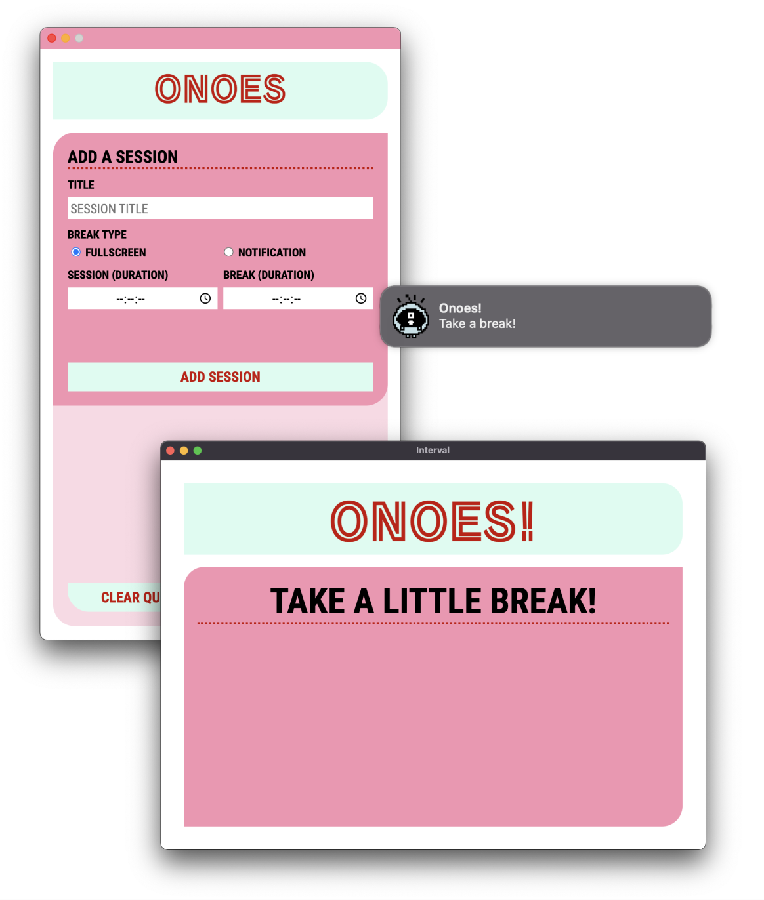

## ONOES

A small electron-based app for macOS to help you do pomodoro or session-based notifications/reminders.

Wanna see how it's made? Check out the [package.json](https://github.com/khendrikse/onoes/blob/main/package.json)!

### Why?

I wanted a pomodoro-type timer that I could customize and that looked cute. So I made it. Another big learn for me was that I was just gonna make it, publish it, and not look back anymore. Fighting perfectionism and focus my time actually using the app, and not feeling very self-aware about the code itself. Knowing I could do better, but deciding I don't want to. Hah!

